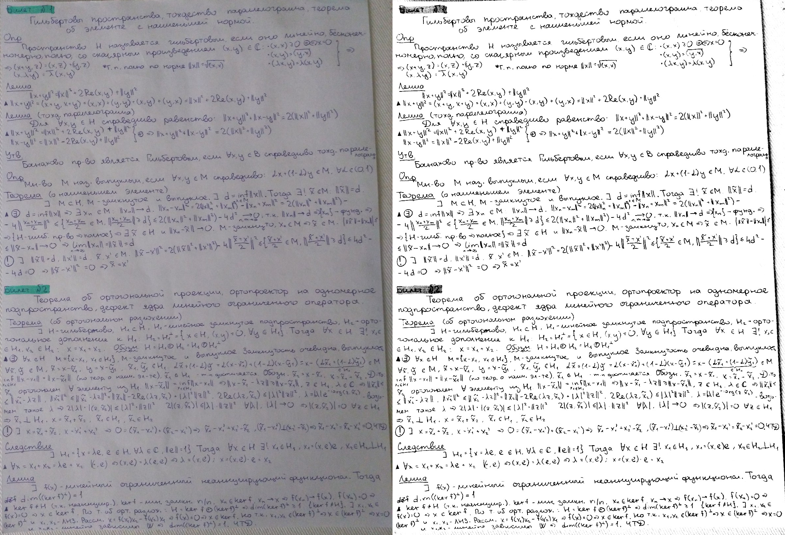
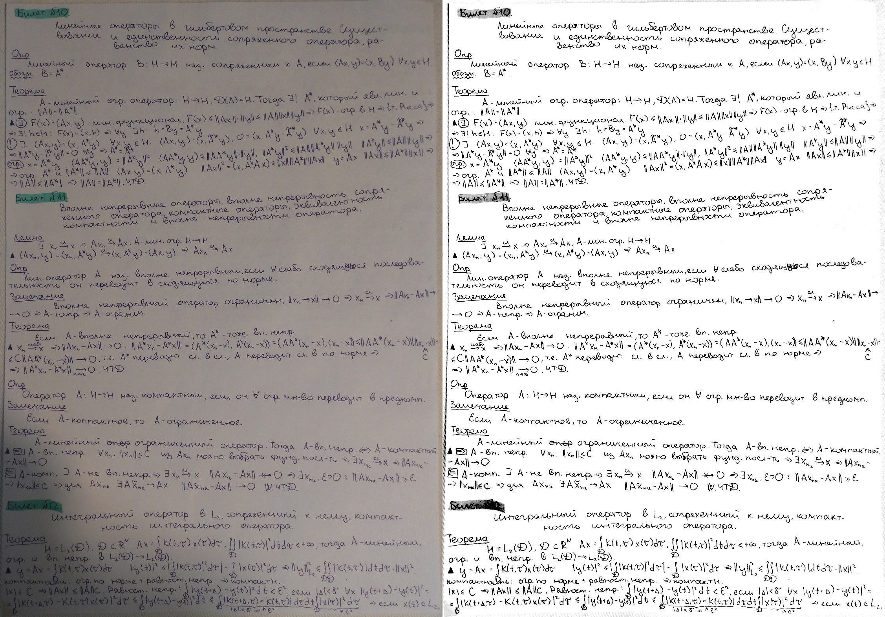
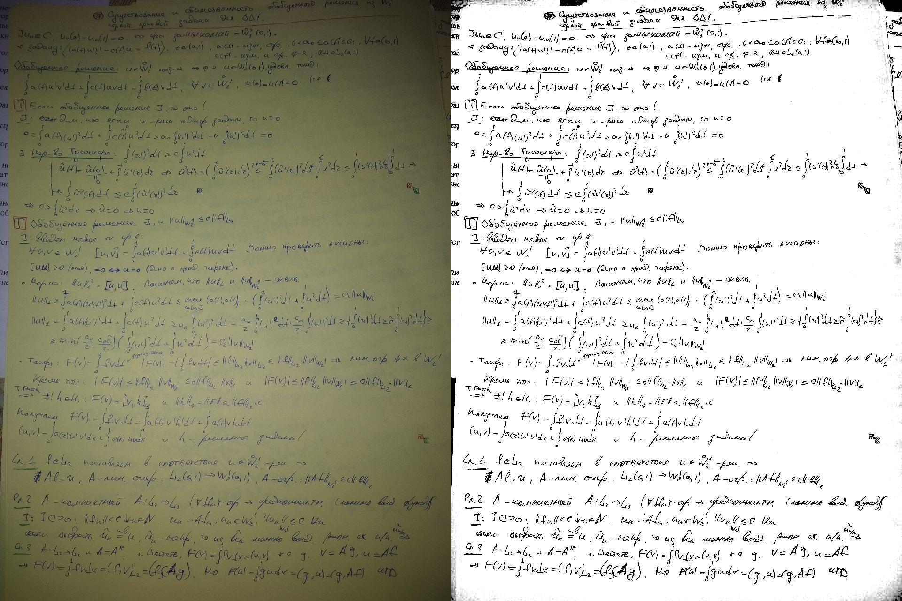

# Notes enhancement

A simple tool for enhancement the photos of documents, notes, books, etc.

It makes lighting uniform and increases the contrast of the images.

## Example of usage:

`python3 enhance.py img.jpg -o output.jpg --gray --sigma 50 --thrs 0.7 0.95`

## Parameters:

`--gray` makes grayscale image,

`--sigma SIGMA` is the parameter for Gaussian filter (required for uniform lighting),

`--thrs LOW HIGH` are two thresholds for contrast stretching,

`--format FMT` is the format of output image.

## Examples:

